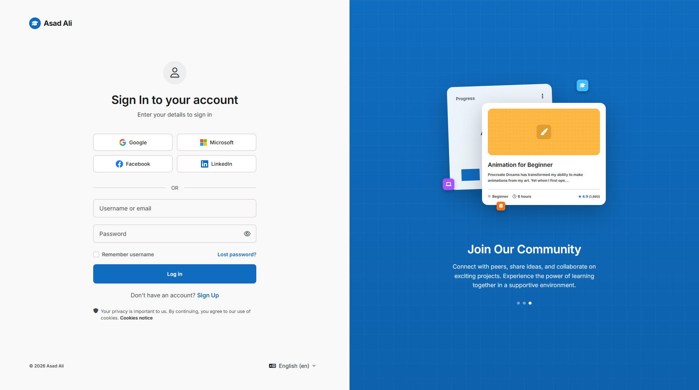

# Logini Theme for Moodle

Logini is a modern, responsive, and highly customizable theme for Moodle, designed to provide a stunning and seamless authentication experience. It is specifically focused on delivering beautiful, dynamic login and sign-up pages, complete with OAuth social login integrations and elegant design aesthetics.

## Features

- **Beautiful Authentication Interface:** Replaces Moodle's default login pages with a premium, engaging design.
- **Social Logins Support:** Built-in styling and layout exclusively designed to accommodate the following OAuth social login providers: Google, Facebook, LinkedIn, and Microsoft.
- **Fully Responsive:** Looks and functions perfectly on desktops, tablets, and mobile devices.
- **Boost Child Theme:** Built on top of Moodle's core Boost theme for maximum stability, performance, and compatibility.
- **Customizable:** Easily customizable through the theme settings page to match your organization's branding.

## Installation

1. Download the zip file of this repository or clone it directly.
2. Extract the contents into the `theme/logini` directory of your Moodle installation.
3. Log in to your Moodle site as an administrator.
4. Navigate to **Site administration > Notifications** to initiate the plugin installation process.
5. Follow the on-screen instructions to upgrade the Moodle database.
6. Once installed, navigate to **Site administration > Appearance > Themes > Theme selector** to set Logini as your active theme.

## Configuration

After installation, you can configure the theme by going to:
**Site administration > Appearance > Themes > Logini**

From the settings page, you can configure branding, customize the login page layout, and toggle various visual features.

## Requirements

- Moodle 5.0 to 5.2 (Requires version `2025041400` or above).
- Theme Boost (Core).

## License

This plugin is licensed under the [GNU General Public License v3 or later](http://www.gnu.org/copyleft/gpl.html).

## Copyright

2026 Softosmith.com and Asad Ali

---

## About the Developer & Custom Development

This theme was proudly developed by **Asad Ali** and made publicly available by **[Softosmith](https://softosmith.com)**. 

At Softosmith, we specialize in creating premium, custom e-learning solutions. **We are available for custom Moodle projects, theme development, plugin creation, and LMS consulting.** 

If you need a completely custom Moodle experience, or want to extend this theme with new features tailored to your organization, please reach out to us at [softosmith.com](https://softosmith.com)!
